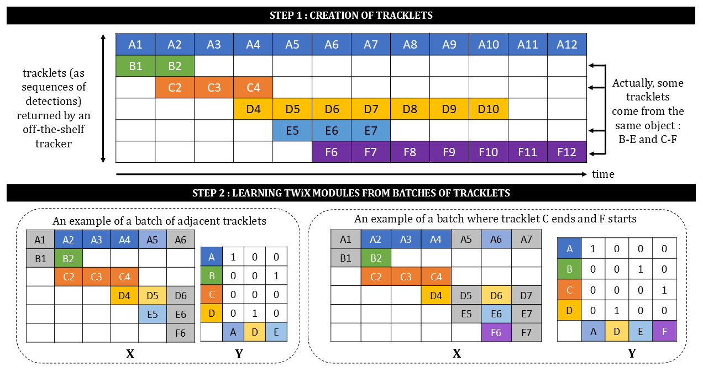
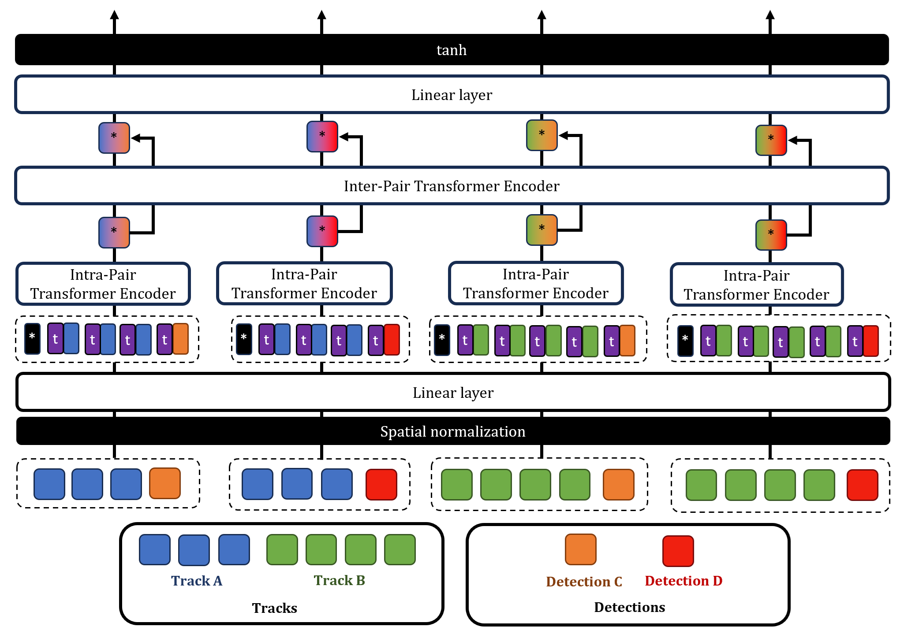

# TWiX

The TWiX module is trained to discriminate positive made of a track and a detection from negative pairs. A pair is classified as positive if:
- a tracker (e.g. TrackerIoU) linked the detection with the track;
- or, if the ground truth identity of the detection matches that of the track. 

This strategy only requires manual annotation at the __tracklet__ level, rather than at the level of individual __detections__.

## Creation of batches of data

As illustrated below, (top) the TWiX module is trained using batches of data, each consisting of two temporal windows:
- a __past window__ made of tracks of prior observations;
- a __future window__ made of detections.

<p align="center"></p>

The temporal windows cover all tracklets produced by TrackerIoU. Two approaches are implemented for creating data batches:
- (bottom left) without temporal gap (`max_gap=0`): the two temporal windows are adjacent, presenting a simple scenario where the goal is to associate detections with tracks across consecutive frames (short-term association). This approach is referred to as `--frame`;
- (bottom right) with temporal gap (`max_gap>0`): the two temporal windows are separated by a gap, creating a more challenging scenario where the objective is to associate detections with tracks after a number of frames (long-term association). To manage the exponential growth of possible batches, only batches where a tracklet ends in the earlier window and another starts in the later window are selected. This approach is referred to as `--tracklet`.

## Module TWiX

As illustrated below, the TWiX module estimates the similarity between pairs using a two-step process:
- first, it generates an independent embedding for each pair using the `Intra-Pair Transformer Encoder`;
- second, it refines the embeddings by incorporating interactions between all pairs using the `Inter-Pair Transformer Encoder`.

<p align="center"></p>

## Training a TWiX module

The output of the TWiX module is a matrix and not a single binary value. To account for interactions between pairs, a novel loss function, the __bidirectional contrastive loss__, is introduced. Inspired by constrastive learning, this loss ensures that positive pairs achieve higher similarity scores than negative pairs within the same row or column.

You can monitor TWiX training using:
```bash
tensorboard --logdir .

# Results for short-term association are logged under 'rsta'
# Results for long-term association are logged under 'rlta'
```

## Download batches of data and TWiX weights

(Optional) You can download preprocessed batches of data and pretrained TWiX weights:
```bash

# Data for MOT17, KITTIMOT, DanceTrack
wget https://mehdimiah.com/static/twix/data.zip
unzip data.zip -d data/
rm data.zip

# TWiX weights for MOT17, KITTIMOT, DanceTrack
wget https://mehdimiah.com/static/twix/weights.zip
unzip weights.zip -d .
rm weights.zip
```

## File organization

The organization of this folder is as follows:

```plaintext
twix
├── data
|   ├── DanceTrack
|   └── ...  
├── rsta
|   ├── DanceTrack
|   └── ...
├── rlta
|   ├── DanceTrack
|   └── ...
├── data.py
├── loss.py
├── README.md
├── train.py
└── twix.py
```

