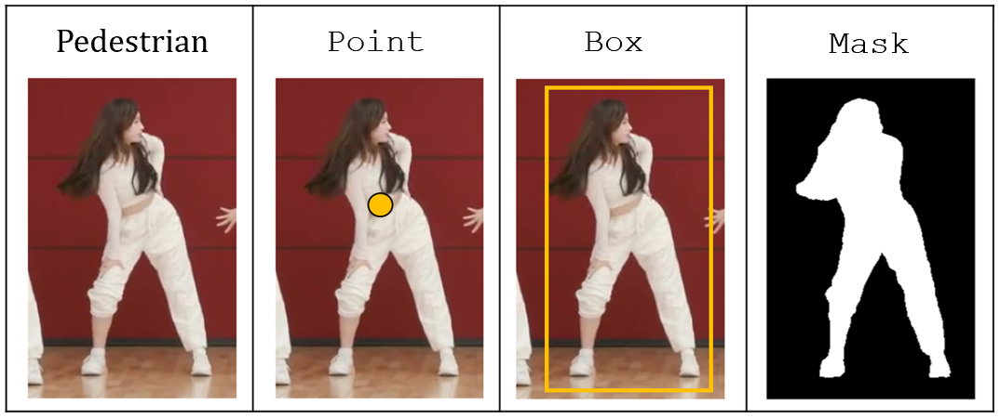

# Structures

This folder contains the fundamental classes required to implement and run a tracker.

#### Locator

The `Locator` class represents a spatial location and includes three subclasses that define different levels of spatial precision. The figure below illustrates these types of locations:

<p align="center"></p>

The `Locator` class includes built-in functions to calculate common distance and similarity metrics such as L1​ distance, IoU and mIoU.

```python
from structures.locator import Point, Box, Mask

p1, p2 = Point(5, 2), Point(8, 9)
print(f"L1 distance between points: {p1.d1(p2):0.3f}")  # 10.000

box1, box2 = Box([0, 0, 5, 9]), Box([3, 4, 5, 9])
print(f"IoU distance between boxes: {box1.IoU(box2):0.3f}")  # 0.300

mask1 = Mask(rle=r'dYU8c0R;4L101N2N2O101M4L4L3N1O1O1O1000O001O1O10000O1000000000000O10O1000000001O00000000000000000000001O0000000000001O10O100001O1N101N2N2N2M3N7G[XX5', img_width=1242, img_height=375)
mask2 = Mask(rle=r'WQV89[;;G2L4M2O1N2O1O1N3O3L3M1O1O1O1O1O01O1N110O100O001000000000000000000000000000000000001O0000000000000000000000001O0001O01001O01O1O0O2N2N1O3L3N2M7H5A_fU5', img_width=1242, img_height=375)
print(f"mIoU distance between masks: {mask1.mIoU(mask2):0.3f}")  # 0.785
```

#### Observation

The `Observation` class defines an observation: it contains a `Locator`, an object class, a frame number, an objectID and a flag indicating the observation type (e.g., ground truth).

```python
from structures.locator import Mask
from structures.observation import Observation

mask = Mask(rle=r"XQa53c;4L2O001O0000O2N2NYTb8", img_width=1242, img_height=375)
obs = Observation(classe='person', score=0.85, frame=1, locator=mask, objectID=1, flag='_GT_')
```

#### ObsCollection

The `ObsCollection` class is a container for multiple `Observation` instances. It can group observations by frame, objectID, or a historical timeline.

#### BaseDataset

The `BaseDataset` class defines a dataset and serves as a foundation for custom dataset implementations. For more information, refer to the [src/datasets/README.md](../datasets/README.md).

#### Track

The `Track` class represents a collection of `Observation` instances that belong to the same objectID.

#### Tracker

The `Tracker` class defines the pipeline for running a tracker, orchestrating the process of associating observations and managing tracks over time.
