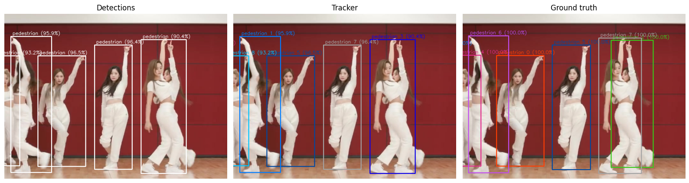

# Viz

Three levels of visualization are implemented: at the detection level, at the tracker level and at the ground truth level.

<p align="center"></p>

## Detections

To visualize the detections, please run:

```bash
# One scene of DanceTrack-train with the detector bytetrack_model
python viz_detections.py --dataset DanceTrack --subset train --detection bytetrack_model --scene dancetrack0001

# All scenes of DanceTrack-train with the detector bytetrack_model
python viz_detections.py --dataset DanceTrack --subset train --detection bytetrack_model
```
The videos are stored in the folder `<PATH_BASE>/results/<dataset>-<subset>/Detection/<detection>`.

## Tracker

To visualize the results of a tracker, please run:

```bash
# One scene of DanceTrack-train, stored in the specific folder 
python viz_benchmark.py --dataset DanceTrack --subset train --folder TrackerIoU/bytetrack_model/0.50_128_0.15 --scene dancetrack0001

# All scenes of DanceTrack-train, stored in the specific folder 
python viz_benchmark.py --dataset DanceTrack --subset train --folder TrackerIoU/bytetrack_model/0.50_128_0.15
```

The videos are stored in the folder `<PATH_BASE>/results/<dataset>-<subset>/Tracking/<folder>`.

## Ground truth

To visualize the ground truth annotations, please run:

```bash
# One scene of DanceTrack-train
python viz_ground_truth.py --dataset DanceTrack --subset train --scene dancetrack0001

# All scenes of DanceTrack-train
python viz_ground_truth.py --dataset DanceTrack --subset train
```
The videos are stored in the folder `<PATH_DATA>/<dataset>/ground_truth`.